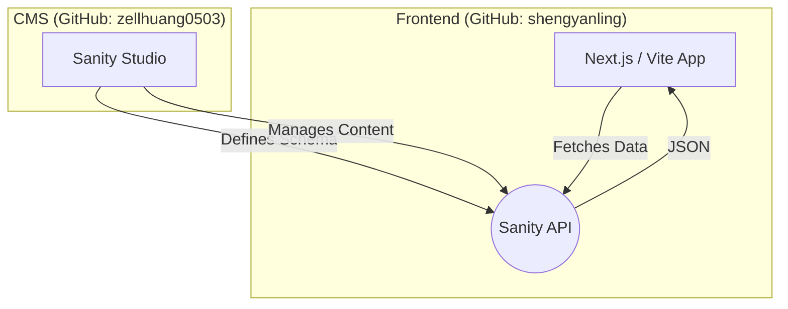

# 專案協作架構手冊 (Project Collaboration Guide)

## 1. 核心架構變更 (Architecture Change)

為了確保開發流程順暢並避免權限衝突，我們已將專案拆分為 **「前端 (Frontend)」** 與 **「後台 (Content Studio)」** 兩個獨立的儲存庫。

這種 **Headless CMS 架構** 能讓我們並行開發：
- **前端 (Student)**：專注於 UI/UX 與資料呈現。
- **後台 (Zell)**：專注於資料結構 (Schema) 與內容管理。



---

## 2. 儲存庫資訊 (Repositories)

| 負責人 | 專案類型 | GitHub Repository URL | 說明 |
|--------|----------|----------------------|------|
| **學生** | **Frontend (前端)** | `https://github.com/shengyanling/rumah_papan` | 包含所有頁面、樣式、互動邏輯。 |
| **Zell** | **CMS (後台)** | `https://github.com/zellhuang0503/rumah_papan_studio` | 包含 Sanity Schema 定義與配置。 |

---

## 3. 前端開發指南 (For Student)

由於後台已獨立，前端不再包含 `studio` 資料夾。你需要做的是 **「連接」** Sanity API。

### Step 1: 安裝 Sanity Client
確保專案中安裝了必要的套件：
```bash
npm install @sanity/client @sanity/image-url
```

### Step 2: 設定環境變數 (.env)
請在專案根目錄建立或更新 `.env` 檔案，填入以下資訊（請向 Zell 索取具體數值）：

```env
# .env.local
VITE_SANITY_PROJECT_ID=vm3p10fe
VITE_SANITY_DATASET=production
VITE_SANITY_API_VERSION=2024-01-01
# 如果是用 Next.js，變數名稱可能是 NEXT_PUBLIC_SANITY_...
```

### Step 3: 獲取資料 (範例)
使用 `client.fetch` 來獲取內容：

```typescript
// utils/sanity.ts (範例)
import { createClient } from '@sanity/client'
import imageUrlBuilder from '@sanity/image-url'

export const client = createClient({
  projectId: import.meta.env.VITE_SANITY_PROJECT_ID, // 或 'vm3p10fe'
  dataset: import.meta.env.VITE_SANITY_DATASET,      // 或 'production'
  useCdn: true, // 設為 true 可啟用快取，速度更快
  apiVersion: '2024-01-01',
})

// 圖片 URL 產生器
const builder = imageUrlBuilder(client)
export function urlFor(source: any) {
  return builder.image(source)
}

// 在頁面中使用範例：
// const posts = await client.fetch(`*[_type == "post"]`)
```

---

## 4. 協作流程 (Workflow)

1.  **Schema 變更**：
    *   如果前端需要新的欄位（例如：新增一個「作者」欄位），請通知 Zell。
    *   Zell 會在 CMS Repo 更新 Schema 並部署。
    *   前端無需修改代碼，只需確認 API 能抓到新資料即可。

2.  **型別同步 (Type Safety)**：
    *   建議前端維護一份 TypeScript Interface，對應 Sanity 的回傳資料。
    *   或者我們會設定自動化流程，從 CMS 匯出 `types.ts` 給前端使用。

3.  **圖片處理**：
    *   Sanity 的圖片是透過 URL 提供的。使用 `urlFor(imageSource).width(800).url()` 來取得優化後的圖片連結。

---

## 5. 常見問題 (FAQ)

*   **Q: 我原本 cloning 下來的專案裡有 `studio` 資料夾，現在怎麼辦？**
    *   A: 請重新 `git pull` 更新前端儲存庫。新的架構中，`studio` 資料夾已被移除。請**不要**在前端專案中嘗試啟動 Sanity Studio。

*   **Q: Vercel 部署失敗？**
    *   A: 請確認 Vercel 的 Environment Variables 是否已填入正確的 Project ID 和 Dataset。

*   **Q: 無法讀取資料 (403 Error)？**
    *   A: 請確認 Sanity 管理後台 (sanity.io/manage) 的 **API > CORS Origins** 是否已加入 `http://localhost:5173` (或你的開發 port) 以及 Vercel 的正式網域。
